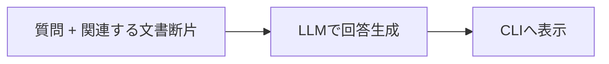

# 回答生成詳細設計

## 処理の流れ

```mermaid
flowchart LR
    A["質問 + 関連する文書断片"] --> B[LLMで回答生成]
    B --> C[CLIへ表示]
```

## 回答生成

HaskellからPythonへ質問と関連する文書断片を渡す。  
PythonはLLMを使って回答を生成し、Haskellへ返す。

## CLI表示

Haskellは生成した回答をCLIへ表示する。
