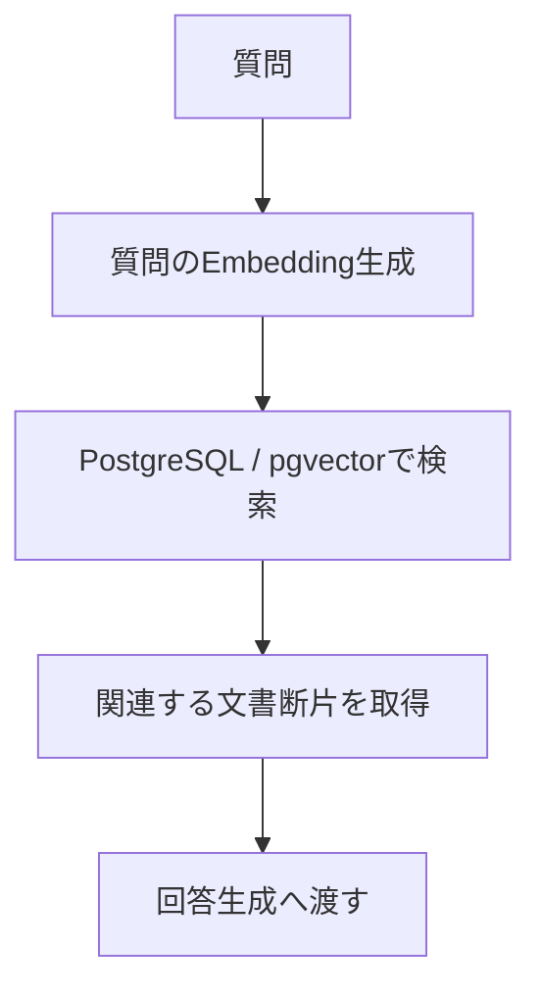

# 関連文書検索詳細設計

## 処理の流れ

```mermaid
flowchart TD
    A[質問] --> B[質問のEmbedding生成]
    B --> C["PostgreSQL / pgvectorで検索"]
    C --> D[関連する文書断片を取得]
    D --> E[回答生成へ渡す]
```

## 質問のEmbedding生成

HaskellからPythonへ質問を渡し、質問のEmbeddingを生成する。

## 文書断片検索

質問のEmbeddingを使ってPostgreSQL / pgvectorから関連する文書断片を検索する。

## 回答生成への受け渡し

検索した文書断片を質問とともに回答生成へ渡す。
